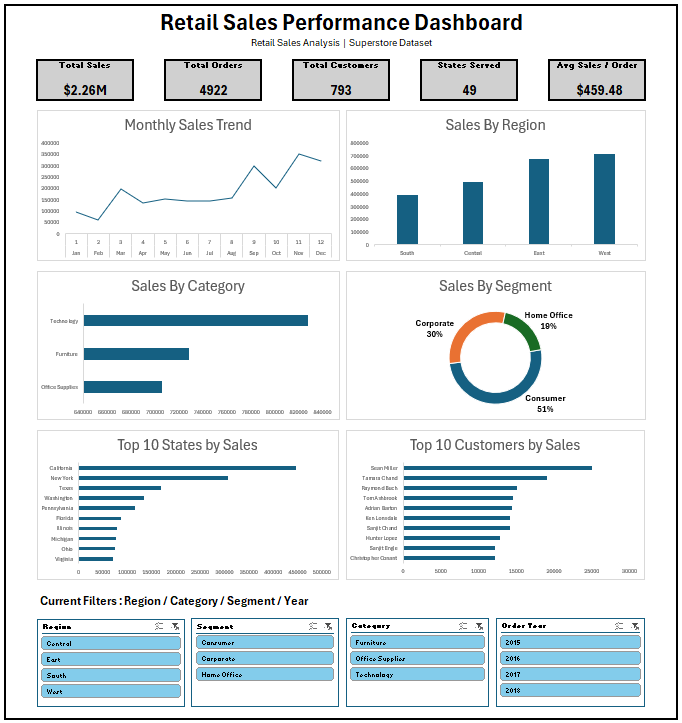

# Retail Sales Performance Dashboard

An Excel-based sales analytics project that transforms 9,801 retail transactions into a KPI-driven dashboard and business performance analysis.

**🌐 Portfolio:** [View the project on my portfolio](https://aryan-singhai.github.io/retail-sales-dashboard.html)

---

## 📌 Project Overview

The project analyzes retail sales performance across regions, categories, customer segments, cities and time periods. The objective is to identify performance patterns and translate them into concise business insights.

**Dataset:** 9,801 sales records  
**Primary tool:** Microsoft Excel

## 🎯 Business Questions

- Which regions and categories generate the most sales?
- Which customer segments contribute the most revenue?
- Which months and years perform best?
- Which cities and business areas stand out?
- What are the core sales and order KPIs?
- What patterns should management monitor?

## 🛠️ Tools & Skills

- Microsoft Excel
- Data cleaning
- PivotTables & PivotCharts
- KPI analysis
- Dashboard development
- Sales performance analysis
- Data visualization
- Business insight generation

## 📊 Dashboard Preview

## 🔍 Key Insights

- **Total Sales:** $2.26M
- **Total Orders:** 4,922
- **Highest-Performing Region:** West
- **Highest-Performing Category:** Technology
- **Highest-Performing Customer Segment:** Consumer
- **Highest-Sales Month:** November
- **Highest-Sales Year:** 2018

## 📁 Project Files

| File | Purpose |
|---|---|
| `Retail_Sales_Performance_Dashboard.xlsx` | Final Excel dashboard and analysis |
| `images/retail-sales-dashboard.png` | Dashboard preview |

## 💡 What This Project Demonstrates

This project demonstrates the ability to clean structured data, build PivotTable-based analysis, define and track KPIs, create an interactive dashboard and communicate business performance through data.

## 🚀 Analytics Journey

This is **Project 01** in my analytics portfolio, followed by a SQL business analysis project and future Power BI and end-to-end projects.

**Next:** SQL → Power BI → End-to-End Analytics

---

**Portfolio:** [aryan-singhai.github.io](https://aryan-singhai.github.io/)  
**GitHub:** [github.com/Aryan-Singhai](https://github.com/Aryan-Singhai)  
**LinkedIn:** [linkedin.com/in/aryan-singhai](https://www.linkedin.com/in/aryan-singhai/)
